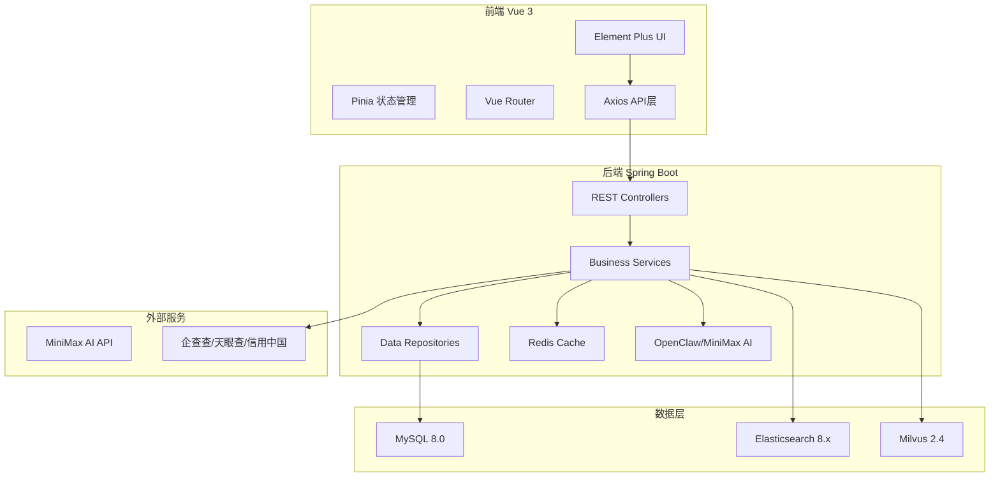
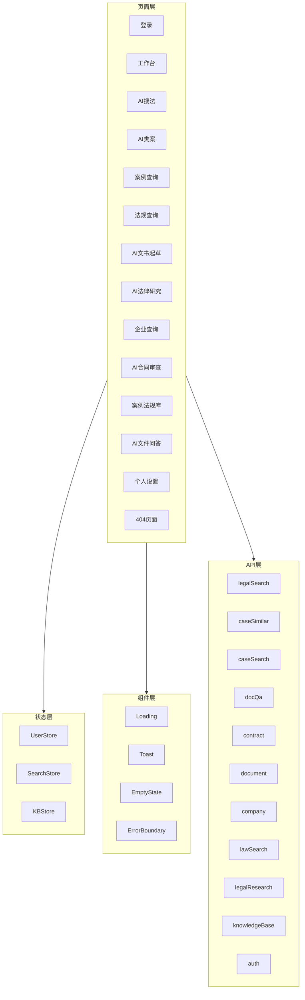

# 法律AI助手系统 - 系统架构

## 整体架构



## 后端架构

```mermaid
graph LR
    subgraph Controllers["控制器层"]
        Auth["AuthController"]
        LegalSearch["LegalSearchController"]
        CaseSearch["CaseSearchController"]
        CaseSimilar["CaseSimilarController"]
        Contract["ContractReviewController"]
        DocQa["DocQaController"]
        Document["DocumentController"]
        Company["CompanyQueryController"]
        LawSearch["LawSearchController"]
        LegalResearch["LegalResearchController"]
        KnowledgeBase["KnowledgeBaseController"]
    end

    subgraph Services["服务层"]
        AuthService
        LegalSearchService
        CaseService
        CaseSimilarService
        ContractService
        DocQaService
        DocumentService
        CompanyService
        LawSearchService
        LegalResearchService
        KnowledgeBaseService
        AIService
    end

    subgraph Repositories["仓储层"]
        CaseInfoMapper
        LegalCaseMapper
        LawDocumentMapper
        LawArticleMapper
        SearchLogMapper
    end

    Controllers --> Services
    Services --> Repositories
    Services --> AI
```



## 前端架构



## API 网关模式

所有前端请求通过 `/api/v1` 前缀路由到后端：

```
/api/v1/auth/*              # 认证相关
/api/v1/legal-search/*      # AI搜法
/api/v1/case-similar/*      # AI类案
/api/v1/case-search/*      # 案例查询
/api/v1/law-search/*        # 法规查询
/api/v1/document/*         # AI文书起草
/api/v1/legal-research/*   # AI法律研究
/api/v1/company/*          # 企业查询
/api/v1/contract/*         # AI合同审查
/api/v1/doc-qa/*           # AI文件问答
/api/v1/knowledge-base/*   # 知识库
```

## 核心数据流

### AI搜法流程
```
用户输入查询 → Query理解 → 意图识别 →
ES BM25检索 + Milvus ANN检索 → RRF融合 →
Rerank重排序 → OpenClaw生成回答 → 引用溯源 → 返回结果
```

### AI类案流程
```
用户输入案件描述 → 案件要素提取 → 向量化 →
Milvus ANN检索 → 多维度相似度计算 →
Rerank重排序 → 裁判要点生成 → 返回类案列表
```

### AI合同审查流程
```
上传合同 → 文本提取 → 8维度AI审查 →
风险分级 → 改进建议生成 → 审查报告 → 返回结果
```

### 文档问答流程
```
用户提问 → 混合检索 → RRF融合 →
上下文构建 → OpenClaw生成答案 → 引用溯源 → 返回结果
```

## 安全架构

- JWT Token 认证
- 请求限流（Redis）
- CORS 配置
- 参数校验
- AI幻觉检测

## 扩展性设计

- 微服务架构预留
- 配置中心支持
- 插件化AI provider
- 多数据源支持