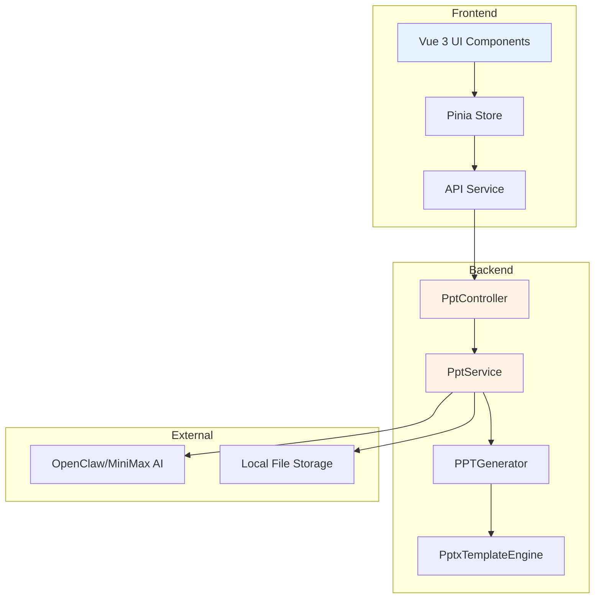
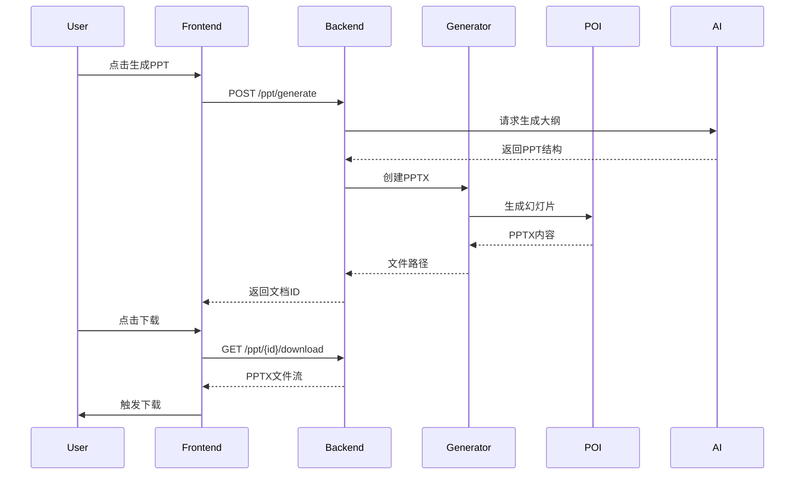

# PPT演讲稿生成器 - Technical Design

Feature Name: ppt-generator
Updated: 2026-06-17

## Description

法律AI助手的PPT演讲稿生成模块，基于AI法律搜索结果生成结构化PPT大纲，支持前端实时预览、用户编辑、模板选择，最终导出PPTX文件。

## System Architecture



## Components and Interfaces

### Frontend Components

| Component | Responsibility |
|-----------|----------------|
| PptEditor.vue | PPT大纲编辑主界面 |
| PptPreview.vue | PPT实时预览组件 |
| SlideItem.vue | 单张幻灯片编辑项 |
| TemplateSelector.vue | 模板选择面板 |
| FileManager.vue | PPT文件管理列表 |

### Backend Components

| Component | Responsibility |
|-----------|----------------|
| PptController | REST API端点 |
| PptService | 业务逻辑编排 |
| PPTGenerator | AI生成PPT内容 |
| PptxTemplateEngine | PPTX文件生成 |
| PptTemplateService | 模板管理 |

## API Endpoints

### PPT生成

```
POST /api/v1/ppt/generate
Request: {
  "title": "string",
  "searchResults": [SearchResultItem],
  "template": "string"
}
Response: {
  "id": "string",
  "title": "string",
  "slides": [Slide],
  "template": "string"
}
```

### PPT编辑

```
PUT /api/v1/ppt/{id}
Request: PPTDocument
Response: PPTDocument
```

### PPT下载

```
GET /api/v1/ppt/{id}/download
Response: application/vnd.openxmlformats-officedocument.presentationml.presentation
```

### PPT列表

```
GET /api/v1/ppt/list
Response: {
  "items": [PPTDocument],
  "total": number
}
```

### PPT删除

```
DELETE /api/v1/ppt/{id}
Response: { "success": boolean }
```

### 模板列表

```
GET /api/v1/ppt/templates
Response: [PPTTemplate]
```

### AI推荐模板

```
POST /api/v1/ppt/templates/recommend
Request: { "scenario": "string" }
Response: [PPTTemplate]
```

## Data Models

### PPTDocument Entity

```java
@Entity
@Table(name = "ppt_document")
public class PptDocument {
    @Id
    private String id;
    private String title;
    private String slidesJson; // JSON序列化
    private String templateId;
    private String userId;
    private String filePath;
    private LocalDateTime createdAt;
    private LocalDateTime updatedAt;
}
```

### Slide DTO

```java
public class SlideDTO {
    private String id;
    private String layout; // title_only, title_content, two_column, blank
    private String title;
    private List<String> bulletPoints;
    private String notes;
    private String backgroundUrl;
}
```

### PPTTemplate

```java
public class PptTemplate {
    private String id;
    private String name;
    private String thumbnail;
    private String primaryColor;
    private String secondaryColor;
    private String fontFamily;
    private String backgroundStyle;
    private String source; // local, ai
}
```

## PPTX Generation Strategy

### Library Choice

使用 Apache POI 5.2.5 生成PPTX文件：
- 成熟的PPTX操作库
- 支持复杂格式设置
- 无需安装Office

### Generation Flow



## Template System

### Built-in Templates

```javascript
const TEMPLATES = [
  {
    id: 'legal-blue',
    name: '法律蓝调',
    primaryColor: '#1a365d',
    secondaryColor: '#2c5282',
    fontFamily: 'Microsoft YaHei',
    background: 'gradient'
  },
  {
    id: 'purple-peak',
    name: '紫禁之巅',
    primaryColor: '#553c9a',
    secondaryColor: '#805ad5',
    fontFamily: 'Microsoft YaHei',
    background: 'gradient'
  },
  {
    id: 'professional',
    name: '专业沉稳',
    primaryColor: '#2d3748',
    secondaryColor: '#4a5568',
    fontFamily: 'Microsoft YaHei',
    background: 'solid'
  },
  {
    id: 'fresh-minimal',
    name: '清新简约',
    primaryColor: '#319795',
    secondaryColor: '#38b2ac',
    fontFamily: 'Microsoft YaHei',
    background: 'light'
  },
  {
    id: 'court-gold',
    name: '法院灰金',
    primaryColor: '#744210',
    secondaryColor: '#d69e2e',
    fontFamily: 'Microsoft YaHei',
    background: 'gradient'
  }
];
```

### AI Template Recommendation

调用AI搜索网络获取专业PPT模板资源，返回模板配置信息。

## UI Layout

### PPT编辑器布局

```
+------------------------------------------------------------------+
|  [返回]  PPT标题 (可编辑)                    [模板] [下载] [保存] |
+------------------------------------------------------------------+
|                    |                                              |
|    幻灯片列表       |              预览区域                         |
|    +-----------+   |   +----------------------------------+       |
|    | Slide 1   |   |   |                                  |       |
|    | Slide 2   |   |   |       当前幻灯片预览               |       |
|    | Slide 3   |   |   |       (实时渲染)                  |       |
|    | + 添加    |   |   |                                  |       |
|    +-----------+   |   +----------------------------------+       |
|                    |                                              |
|                    |   +----------------------------------+       |
|                    |   |        编辑区域                    |       |
|                    |   |  标题: [________________]        |       |
|                    |   |  内容: [________________]        |       |
|                    |   |          [________________]      |       |
|                    |   +----------------------------------+       |
+------------------------------------------------------------------+
```

## Implementation Tasks

### Phase 1: Backend API

- [ ] 创建PptController REST端点
- [ ] 实现PptService业务逻辑
- [ ] 实现PPTGenerator生成器
- [ ] 集成Apache POI生成PPTX
- [ ] 创建PptTemplateService模板服务
- [ ] 编写单元测试

### Phase 2: Frontend Components

- [ ] 创建PptEditor.vue编辑器
- [ ] 创建PptPreview.vue预览组件
- [ ] 创建SlideItem.vue幻灯片项
- [ ] 创建TemplateSelector.vue模板选择器
- [ ] 创建FileManager.vue文件管理器
- [ ] 添加PPT相关API调用

### Phase 3: Integration

- [ ] 在LegalSearch.vue添加"生成PPT"按钮
- [ ] 实现流式进度反馈
- [ ] 集成文件下载功能
- [ ] 美化所有PPT相关页面

## Dependencies

### Backend
- Apache POI 5.2.5 (poi-ooxml)
- Spring Boot 3.2
- MySQL 8.0

### Frontend
- Vue 3.4+
- Element Plus 2.4+
- Axios
- Pinia

## Error Handling

| Error | Handling |
|-------|----------|
| AI生成失败 | 显示错误提示，提供重试按钮 |
| PPTX生成失败 | 记录日志，回退到错误页面 |
| 模板加载失败 | 使用默认模板，显示警告 |
| 文件下载失败 | 显示重试按钮 |

## References

- Apache POI Documentation: https://poi.apache.org/
- PPTX Open XML Format: https://docs.microsoft.com/en-us/openspecs/office_standards/ms-pptx/
