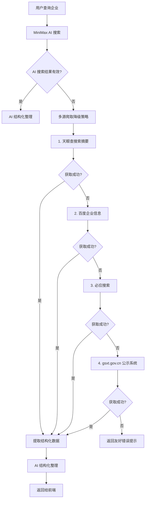

# 企业查询爬虫增强技术设计

## 描述

在现有 `CompanyService` 基础上，新增多层级网页爬取降级策略。当 MiniMax AI 搜索失败或返回结果不足时，按优先级依次尝试天眼查、百度、必应、国家企业信用信息公示系统等公开数据源，从搜索结果摘要和公开页面中提取结构化企业信息。

## 架构



## 组件与接口

### 新增类

| 类名 | 职责 | 位置 |
|------|------|------|
| `EnterpriseScraperService` | 多源爬取降级策略编排 | `service/EnterpriseScraperService.java` |
| `TianyanchaScraper` | 天眼查搜索结果爬取 | `service/scraper/TianyanchaScraper.java` |
| `BaiduEnterpriseScraper` | 百度企业信息爬取 | `service/scraper/BaiduEnterpriseScraper.java` |
| `BingSearchScraper` | 必应搜索爬取 | `service/scraper/BingSearchScraper.java` |
| `GsxtScraper` | 国家企业信用信息公示系统爬取 | `service/scraper/GsxtScraper.java` |
| `HtmlParser` | HTML 解析工具类 | `utils/HtmlParser.java` |
| `RateLimiter` | 爬取速率限制器 | `utils/RateLimiter.java` |

### 修改类

| 类名 | 变更 |
|------|------|
| `CompanyService` | 在 `realQueryCompany` 方法中，当 AI 搜索失败时调用 `EnterpriseScraperService` |

### 接口规范

```java
// EnterpriseScraperService.java
public interface EnterpriseScraper {
    String PLATFORM_NAME = "...";
    int priority();  // 越小优先级越高
    ScrapResult scrape(String companyName);
    boolean isAvailable();  // 检查平台是否可用（未被限流）
}

// ScrapResult.java
public class ScrapResult {
    String rawContent;       // 原始爬取内容
    Map<String, String> extractedFields;  // 提取的字段
    String source;           // 来源平台
    long timestamp;
    boolean success;
    String errorMessage;
}
```

## 数据模型

### ScrapResult

```java
public class ScrapResult {
    private String platform;           // 来源平台名称
    private String rawContent;          // 原始文本内容
    private Map<String, ExtractedField> fields;  // 提取的字段
    private boolean success;           // 是否成功
    private String errorCode;         // 错误码
    private long costMs;              // 耗时
    private LocalDateTime timestamp;
}
```

### ExtractedField

```java
public class ExtractedField {
    private String fieldName;          // 字段名
    private String value;              // 提取的值
    private String rawMatch;           // 原始匹配文本
    private double confidence;         // 可信度 0-1
    private String source;            // 来源
}
```

## 正确性约束

1. **字段优先级**：当多个来源提取同一字段时，优先使用 `confidence` 最高的值
2. **平台可用性**：`isAvailable()` 返回 `false` 时，该平台在冷却期内不参与调度
3. **限流合规**：任何平台的请求频率不超过滑动窗口内 20 次/60 秒
4. **数据完整性**：即使部分来源失败，也返回已成功获取的字段，`missingFields` 列出未获取的字段

## 错误处理

| 场景 | 处理策略 |
|------|---------|
| 403/401 响应 | 标记平台为不可用，切换下一平台 |
| 429 限流 | 等待后重试 1 次，仍限流则标记不可用 |
| 超时（10s） | 重试 1 次，仍超时则切换下一平台 |
| 验证码/反爬页面 | 标记平台不可用，切换下一平台 |
| 所有来源均失败 | 返回 `IllegalStateException`，提示用户可稍后重试 |

## 爬取策略详情

### 天眼查搜索摘要（无需登录）

```
URL: https://www.tianyancha.com/search?key={companyName}
策略: 解析搜索结果列表中的企业名称卡片摘要
限制: 最多提取前 5 条结果，每条结果包含企业名称、状态、法定代表人
```

### 百度企业信息

```
URL: https://www.baidu.com/s?wd={companyName}+企业信息
策略: 解析百度搜索结果中的结构化片段（百度企业信息卡片）
限制: 提取搜索摘要中的工商信息片段
```

### 必应搜索

```
URL: https://cn.bing.com/search?q={companyName}+企业信息+工商
策略: 解析必应搜索结果的摘要片段
限制: 提取前 10 条结果
```

### 国家企业信用信息公示系统

```
URL: https://www.gsxt.gov.cn/corp-query-search-info.html?searchword={companyName}
策略: 通过公示系统的公开搜索接口查询
限制: 需要处理重定向和 JS 渲染
```

## 测试策略

1. **单元测试**：每个 Scraper 独立测试，验证字段提取准确性
2. **集成测试**：模拟网络请求，验证降级策略正确切换
3. **反爬绕过测试**：模拟 403/429 响应，验证平台切换逻辑
4. **Mock 数据测试**：使用本地 HTML 样本测试解析器

## 参考

- 现有 `CompanyService.java` 实现（第 57-89 行：realQueryCompany 逻辑）
- 现有 `AIService.java`：MiniMax 搜索接口
